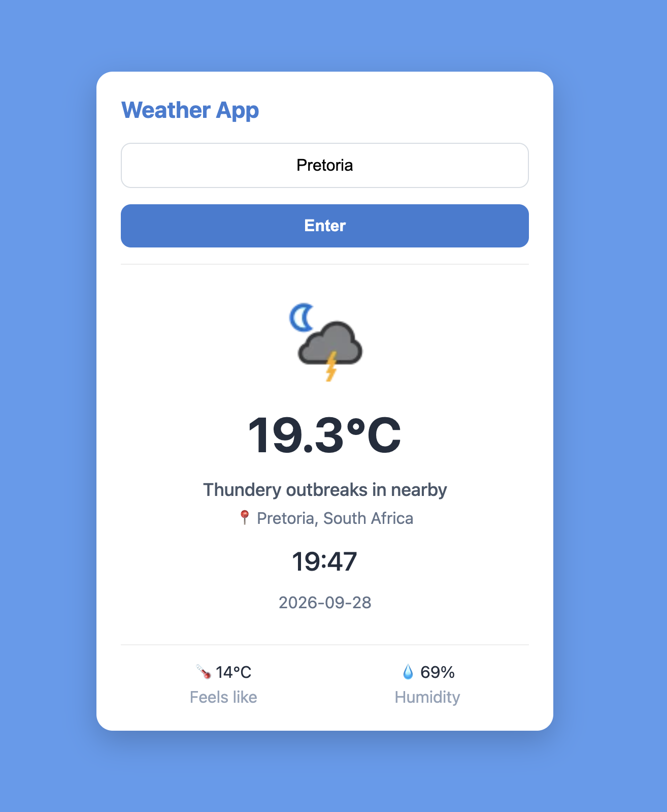

# 🌤️ Current Weather App

A simple weather application that allows users to search for a city and instantly view the current weather conditions for that location.

---

## ✨ About the Project

The **Current Weather App** allows users to search for real-time weather information by entering the name of a city.

Once a city is entered, the application retrieves current weather data and displays important information about the selected location in an easy-to-read format.

The application also displays a **weather icon that matches the current weather conditions**, giving users a quick visual representation of the weather.

---

## 🔎 How It Works

1. The user enters the name of a **city**.
2. The application sends the city to the weather API.
3. The API retrieves the current weather information for that location.
4. JavaScript accesses the returned weather data.
5. The weather information is dynamically displayed on the page.

The application displays:

- 🌎 City and country
- 🌤️ Current weather condition
- 🖼️ Matching weather icon
- 📝 Weather description
- 🌡️ Feels-like temperature in Celsius
- 💧 Humidity
- 🕐 Local time
- 📅 Local date

---

## 🛠️ Built With

- HTML
- CSS
- JavaScript
- Weather API
- Fetch API
- REST API
- DOM Manipulation

---

## 📸 Project Preview



---

## 💡 What I Practiced

This project gave me more experience working with APIs and dynamically displaying information returned from an API.

Some of the skills I practiced include:

- Making API requests with `fetch()`
- Working with JSON data
- Using user input inside an API request
- Accessing nested API data
- Dynamically updating the DOM
- Displaying weather icons from API data
- Working with temperature and humidity data
- Displaying location-specific dates and times
- Handling real-time API information

---

## 🚀 Run the Project

1. Clone the repository:

```bash
git clone https://github.com/smayanja3/weather-api-bootcamp.git
```

2. Open the project folder.
3. Open `index.html` in your browser.
4. Enter a city to view its current weather information! 🌤️🌎

Thanks for checking out my project! 🌦️✨

---

## 🔗 Links

- **GitHub Repository:** [Current Weather App](https://github.com/smayanja3/weather-api-bootcamp.git)